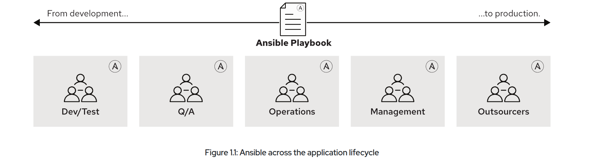
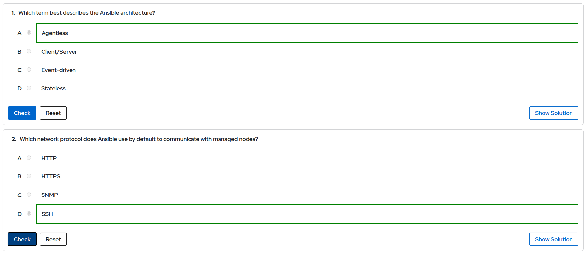
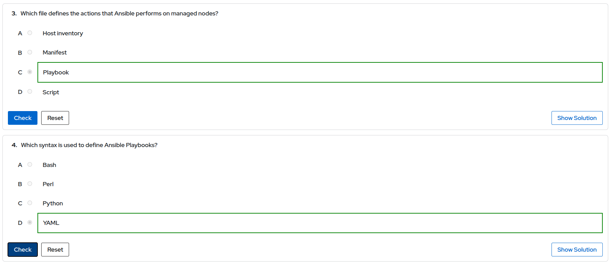

# Automating Linux Administration with Ansible

## Chapter 1.  Introducing Ansible

### Goal: Describe the fundamental concepts of Ansible and how it is used, and install development tools from Red Hat Ansible Automation Platform.

### Objectives: 
- Describe the motivation for automating Linux administration tasks with Ansible, fundamental Ansible concepts, and the basic architecture of Ansible.
- Install Ansible on a control node and describe the distinction between community Ansible and Red Hat Ansible Automation Platform.

### What Is Ansible?
Ansible is an open source automation platform. It is a simple automation language that can accurately describe an IT application infrastructure in Ansible Playbooks. It is also an automation engine that runs Ansible Playbooks.

### Ansible Is Simple:
Ansible Playbooks provide human-readable automation. 

### Ansible Is Powerful:
You can use Ansible to deploy applications for configuration management, for workflow automation, and for network automation. You can use Ansible to orchestrate the entire application lifecycle.

### Ansible Is Agentless
Ansible is built around an agentless architecture.

### Ansible has a number of important strengths:
- Cross platform support: Ansible provides agentless support for Linux, Windows, UNIX, and network devices, in physical, virtual, cloud, and container environments.
 
- Human-readable automation: Ansible Playbooks, written as YAML text files, are easy to read and help ensure that everyone understands what they do.
 
- Precise application descriptions: Every change can be made by Ansible Playbooks, and every aspect of your application environment can be described and documented.
 
- Easy to manage in version control: Ansible Playbooks and projects are plain text. They can be treated like source code and placed in your existing version control system.
 
- Support for dynamic inventories: The list of machines that Ansible manages can be dynamically updated from external sources to capture the correct, current list of all managed servers all the time, regardless of infrastructure or location.

- Orchestration that integrates easily with other systems: HP SA, Puppet, Jenkins, Red Hat Satellite, and other systems that exist in your environment can be leveraged and integrated into your Ansible workflow.

### Ansible: The Language of DevOps

### Ansible Concepts and Architecture:
The Ansible architecture consists of two types of machines: control nodes and managed hosts. 
Managed hosts are listed in an inventory, which also organizes those systems into groups for easier collective management. 
The Ansible architecture is agentless. 

### The Ansible Way: The following goals were used during the design of Ansible.
- Complexity Kills Productivity
- Optimize for Readability
- Think Declaratively

# Use Cases
- Configuration Management
- Provisioning
- Continuous Delivery
- Security and Compliance
- Orchestration

# Quiz: Automating Linux Administration with Ansible

# Summary
- Automation helps you mitigate human error and ensure that your IT infrastructure is in a consistent, correct state.
- Ansible is an open source automation platform that can adapt to many workflows and environments.
- Red Hat Ansible Automation Platform is a fully supported version of Ansible that also includes a number of additional components and tools to help you develop, deploy, and manage your automation code.
- Ansible can be used to manage many types of systems, including servers running Linux, servers running Microsoft Windows, and network devices.
- Ansible Playbooks are human-readable text files that describe the desired state of an IT infrastructure.
- Ansible connects to managed hosts using standard network protocols such as SSH, and runs code or commands on the managed hosts to ensure that they are in the state specified.
- Ansible is built around an agentless architecture in which the Ansible software is only installed on a control node and in automation execution environments.
- Automation content navigator (ansible-navigator) is a key tool that helps you develop and run your Ansible automation code.