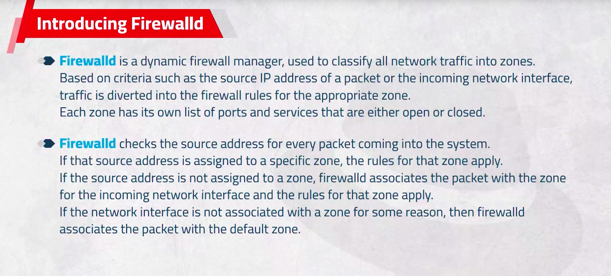
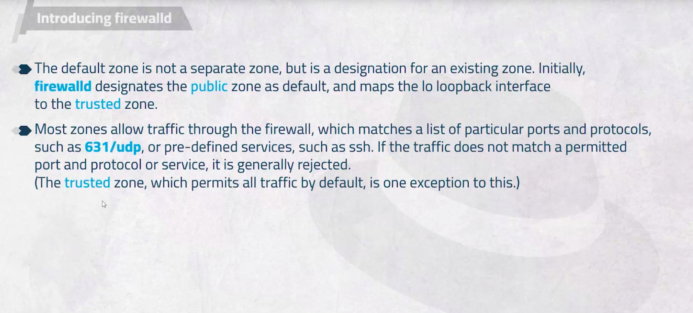
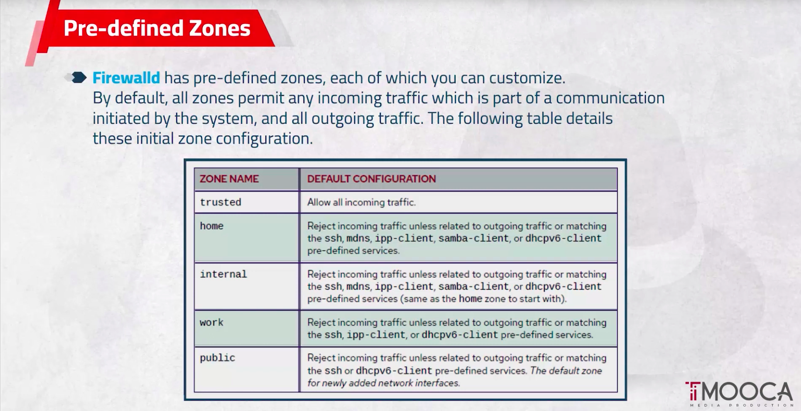
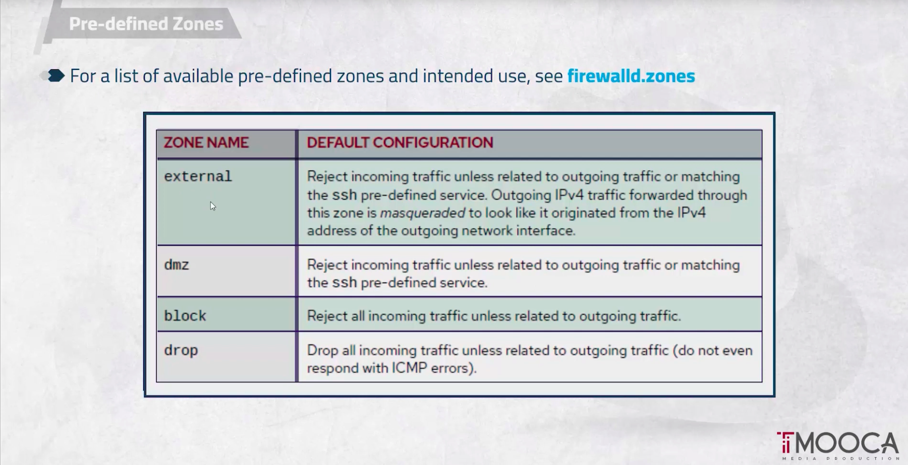
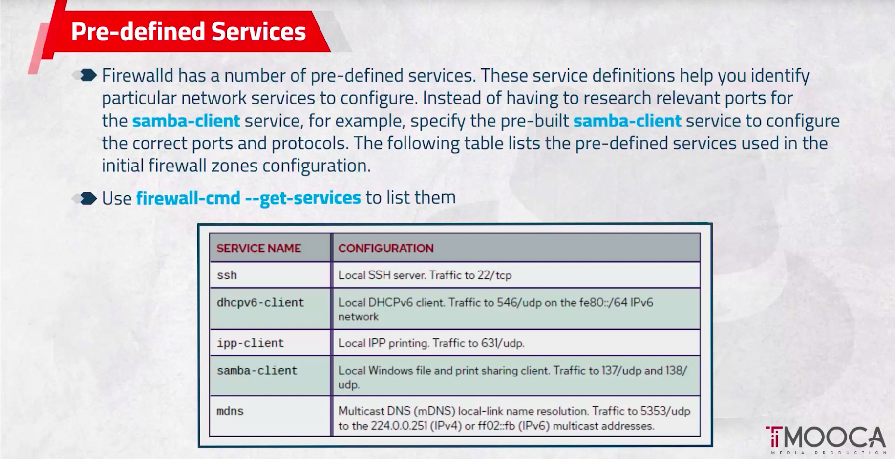
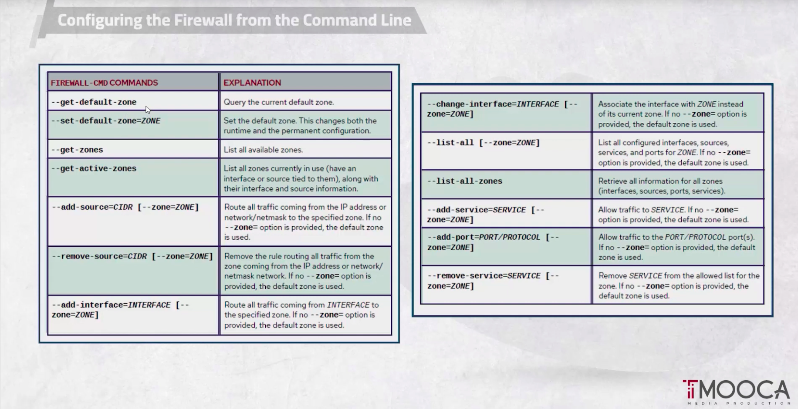

# Chapter 11.  Manage Network Security

### Additional layer of security through the network

## Firewalld: is a dynamic firewall manager, used to classify all network traffic into zones.

## Firewalld: checks the source address for every packet coming into the system




### The firewalld checks:
1. If the source address for a packet belongs to specific zone, apply the rules of this zone on the traffic.
2. if the source address doesn't belongs specific zone, check the incoming network interface is associated to specific zone and apply the rules of zone that this interface belongs it.
3. if the source address and the incoming network interface are not belongs to any zone, apply the `default zone` named `public zone`  on this traffic.



# Pre-defined zones


## All outcome traffic by default allowed
## The income response of outcome traffic by default allowed.


# Pre-defined Services.


### To list all pre-defined services.

```bash
firewall-cmd --get-services
```

# Configuring the Firewall
## The default configuration exist in `/usr/ lib/firewalld/` but not recommended to edit it.
## System administrators interact with firewalld in three ways:
- Directly edit configuration files in `/etc/firewalld/` (not discussed in this chapter).
- The graphical interface.
- The `firewall-cmd` command-line tool.

## Configuration the Firewall from the command line.

Use `--permanent` option to make the action permanent, if not used when reload or restart the configuration will be lost.

```bash
firewall-cmd --permanent 

# need to take affect of `--permanent`
firewall-cmd --reload
```

# Most used command lines.


# Command line.

Check the status of firewalld service.
```bash
systemctl status firewalld.service
# or
firewall-cmd --state

```
To start the firewall service.
```bash 
systemctl start --now firewalld.service
```
To show the available options with firewalld-cmd.
```bass
firewall-cmd --  + double tap
```
If the server has a problem and need to stop the outcoming and incomming traffic.
But if you connect the server using ssh you will loss the connection.

```bash
firewall-cmd --panic-on
```

To share about service.
```bash
firewall-cmd --get-services | grep http
```
# To access the configuration files of services, zones, ...
```bash
cd /usr/lib/firewalld/
ls
# Similar output
# helpers  icmptypes  ipsets  policies  services  xmlschema  zones

cd services

# to get the info about ssh service. 
cat ssh.xml
```

To get the zone add on an interface
```bash
firewall-cmd --get-zone-of-interface=ZONE
```

To add interface.
```bash
firewall-cmd --add-interface=INTERFACE --zone=ZONE 
```

To remove interface.
```bash
firewall-cmd --remove-interface=INTERFACE --permanent --zone=ZONE
```

To Query if interface add in zones.
```bash
firewall-cmd --query-interface=INTERFACE 
```

To list services.
```bash
firewall-cmd --list-services --zone=ZONE
```
NOTE: if you didn't select the zone it will be `public` by default.

# The differences between block and drop.
### block zone : give response ICMP error.(know that exist error)
### drop zone: didn't give any response.(didn't know)
On a client machine.

```bash
ping distination-ip -I source-ip -c NUMBER
```
On a server machine.

one time add the ip of the client to block zone.
```bash
firewall-cmd --add-source=source-ip --zone=block
```

One time add the ip of the client to drop zone.
```bash
firewall-cmd --add-source=SOURCE-IP --zone=drop
```
To check that the ip add to a zone.
```bash
firewall --list-all --zone=block
```
Note that since you add a source to a zone this zone become active
```bash
firewall-cmd --get-active-zones
```
For example if you neet to enable http service you can enable it using:
- pre-defined service:
```bash
firewall-cmd --add-service=http --zone=public --permanent
firewall-cmd --reload
```
- its port and protocol:
```bash
firewall-cmd --add-service=80/tcp --zone=public --permanent
firewall-cmd --reload
```
### you can add a service for specific time using `timeout` option.
```bash
firewall-cmd --add-service={http,https,nfs} --timeout=60 --zone=public
```
You can add customized service or zone under `/etc/firewalld/`
```bash
# to create a customized service.
cd /etc/firewalld/services/
cp /usr/lib/firewalld/services/ssh.xml myssh.xml
# And edit this file as you need.
# Then 
firewalld-cmd --reload

# To create a zone.
# As a service but there another method.
firewalld-cmd --add-zone=
```
# The Graphical Methods
## firewall-config
```bash
# This will install GUI application for firewall.
sudo dnf install firewall-config

```
## cockpit 
```bash
# To add cockpit service.
firewall-cmd --add-service=cockpit

# to Know the port of the cockpit service to login through the browser.
cat /usr/lib/firewalld/services/cockpit.xml

# to enable root login on cockpit opten the file 
vim /etc/cockpit/disallowed-users
# And hash the line of `root`

```
### Add rich rule:
To add more complex and more flixable rules

```bash
firewall-cmd --zone=public --add-rich-rule='rule family="ipv4" source address="192.168.1.8/32" service name="http" accept'
firewall-cmd --add-rich-rule='rule family="ipv4" source address="192.168.1.32/32" drop' --zone=public
```
 
