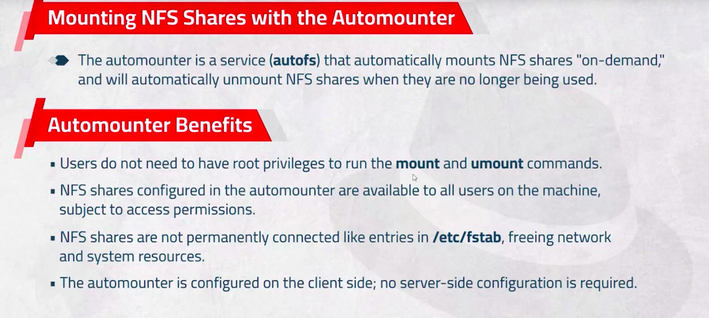
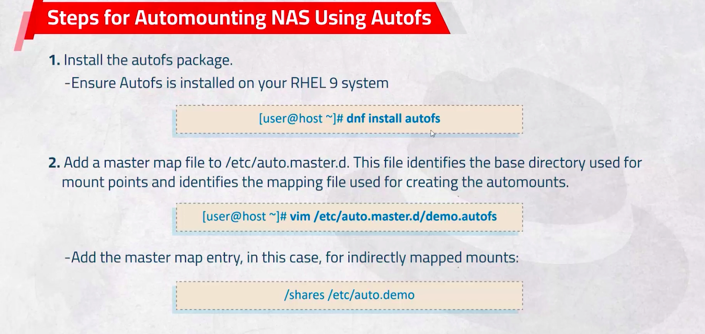
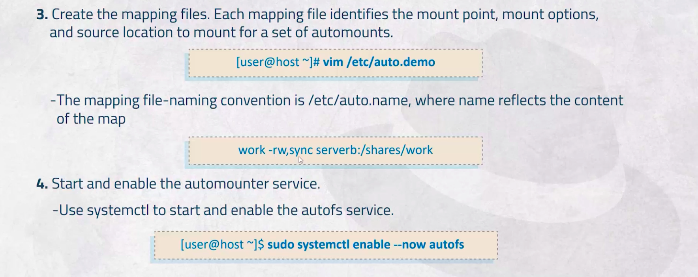
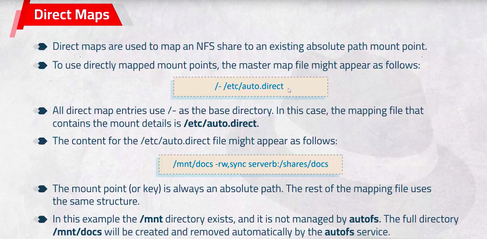
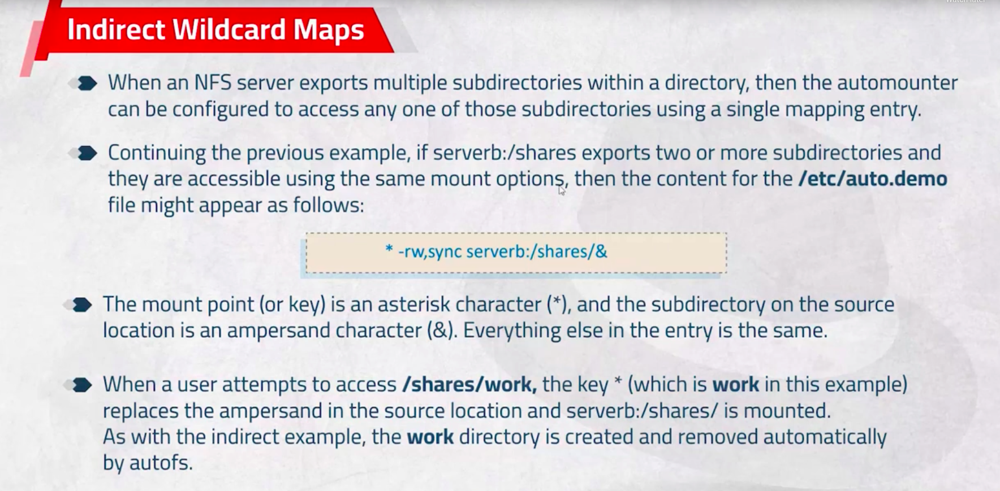

# NFS 
## The steps to chare file between linux machines

## Step1
### install nfs-utils packages on all machines
```bash
# If redhat
sudo dnf install nfs-utils

# If Ubuntu

sudo apt install nfs-utils
```


## On Server machine

### Configure the firewall
You hav two options:
1. stop temporary the firewall
```bash
systemctl stop firewalld
```
2. Enable NFS on the firewall
```bash
firewall-cmd --permanent --add-service=nfs
```

### Write the files that you need to share on /etc/exports
```bash
vim /etc/exports
```
### After this
```bash
# To show the shared files
exportfs 
# To apply all changes on shared file (/etc/exports)
exportfs -a
# Or to apply 
exportfs -r
exportfs -f

# To unexport for all files
exportfs -ua

# To show the all default roles
exportfs -v

# To get more details about options of exports
# 5: is the section that has the info about exports
man 5 exports

# Or restart the nfs server but NOT RECOMMENDED
```

## On the Client machines
### You need to only mount the shared files

### To show files that shared with this machine
```bash
showmount -e serverip
```
NOTES:
You may be encounter an error message:
<per>
clnt_create: RPC: Unable to receive
</pre>
This issues needs to enable rpc-bin, mountd on firewall on the server machine

```bash
firewall-cmd --permanent --add-service=rpc-bind

firewall-cmd --permanent --add-service=rpc-bind

firewall-cmd --reload
```


You hav three options:
1. Manual method (temporary) if reboot the system it will be deleted
```bash
# to show the shared files
showmount -e serverip

# Mount the file
mount -t nfs serverip:/ /mnt

# to show files
df -h

cd /mnt
# to list the shared files 
ls 

# other metho 
mkdir /mnt/external

mount -t nfs serverip:/external /mnt/external

df -hT

```

2. permanent method
# Create a Directory to mount the shared files on it
```bash
mkdir /mnt/part3

vim /etc/fstab
# Add this line
192.168.1.10:/mdia/reda/part3 /mnt/part3   nfs      defaults 0 0

# Save and exit
# mount 
mount -a

# Any change on fstab file run this command to make the system aware about this changes
systemctl daemon-reload

# mount again
mount -a
```


3. On demand method







